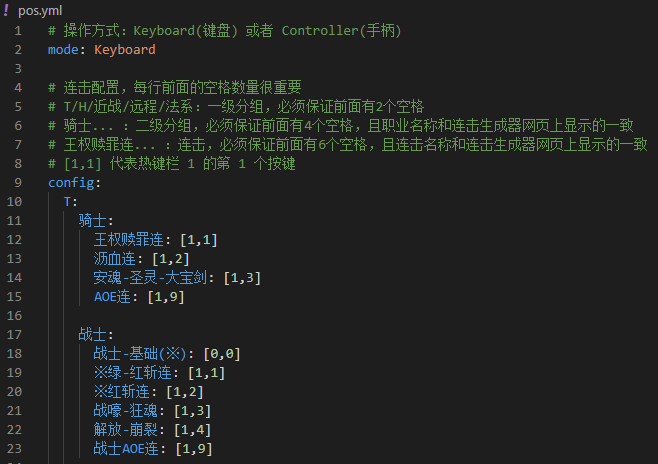
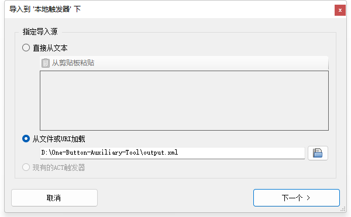

### 功能

一次性生成多个职业的 [一键连击](https://github.com/Yuee98/FFXIVOneButtonCombo)

---
### 使用方法
#### exe版本(windows)
1. 下载 [下载地址](https://github.com/Yuee98/One-Button-Auxiliary-Tool/releases/download/v1.0.0/windows_v1_0_0.zip)
2. 解压后修改 pos.yml (详见里面的注释)

 
 
3. 拖动 pos.yml 到 generate.exe 生成触发器
4. 将生成的 output.xml 文件导入Trigernometry

 

---


#### 命令行版本
1. 安装python
2. clone此repo到本地
```
git clone git@github.com:Yuee98/One-Button-Auxiliary-Tool.git
```
3. 安装依赖
```
pip install -r requirements.txt
```
4. 修改 pos.yml
 
5. 运行 generate.py
```
python generate.py
```
6.将生成的 output.xml 文件导入Trigernometry
